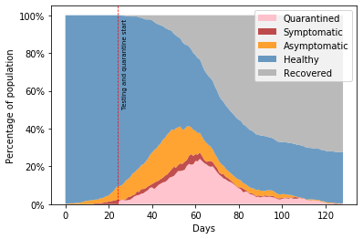

# Pandemic Simulation 🦠

This project allows us to run highly customizable small scale simulation of a pandemic. By tweaking the parameters of the simulation, we can better understands what affects the spread of the infection, and what policies can be put in place to slow down the pandemic.
All results are graphed and important metrics reported.

This simulation was inspired by Grant Sanderson's [youtube video](https://www.youtube.com/watch?v=gxAaO2rsdIs&t=) from the channel [3Blue1Brown](https://www.3blue1brown.com/) with modifications that I wanted to explore.

**Disclamer:** I am not an epidemiologist in any way, the observations that I make from these simulations might not be accurate in "__real life__". This project is more intended to see how changing some parameters can affect the spread of the infection in this controlled simulated environement. (Real world is just way too complex)

## The Simulation Setup

The simulation is made up with several communities with people living in each of these communities. Within these communities, families and friend groups are modelled by increasing their likelyhood to interact compared to two total strangers.

The simulation starts with a few people being infected in one of the communities. People can travel between communities and potentially spread the infection to the other communities. In order to travel, people have to pass by "Travel Hubs" that increase the chance of interacting with others because of the close proximity.

The simulation also supports the idea of public spaces, these can be thought of as grocery stores. The particularity of these public places, is that the chance to interact with other people is increased (due to the close proximity), which increases the chance of getting in contact with someone that is infected

  

### Basic Parameters

The basic parameters that can be configured in the simulation are:

- The number of communities
- The population of each community
- The average incubation time of the infection
- The average time people take to recover after starting to show symptoms
- The number days it takes to infect someone else on average
- The frequency of travel between communities
- The frequency and time spent on trips to public places

**Note:** all these parameters can be highly customized such as "80% of the population will travel between communities on average every 40 days with a standard deviation of 10 days and the remaining 20% of the population never travel"

### Policies

Policies are events that can be triggered when a certain percentage of the total population is simultaneously sick.
(Example: Start social isolation when 5% of the total population is showing symptoms)

- **Social Distancing**: Decreases the frequency of interactions between people
- **Testing and Quarantining**: Tests people shortly after they start showing symptoms and put them in quarantine
- **Travel Restrictions**: Greatly decrease the number of travel between the communities
- **Reduced Trips to Public Places**: Decrease the frequency at which people go to public places

## Results

There is a full analysis of all experiments that I ran in [this](./experiments.ipynb) jupyter notebook. Here, I will summarise the main takeaways.

All simulations are ran with the same parameters to be able to compare them when certain individual policies are implemented.

- 3 communities
- 150 people per community
- Incubation time of infection average of 11 days
- Time being sick after showing symptoms on average is 14 days
- Any individual will transmit the infection to someone else on average every 8 days (To a fully susceptible population)
- 80% of the population travel between communities on average once every 40 days and the rest almost never travel
- People go to public places (such as grocery stores) every 4 days on average and spend about half an hour there

### If nothing is done

When no actions are taken, over 95% of the population gets infected at some point in time. During the peak of simultaneous cases there was over a third of the population that were sick.

  
   
  

### Social Distancing

Social distancing is an effective way to "flatten the curve" and works at its best when everyone is taking part in it. Here we can see that the peak percentage of active cases is 20% compared to close 40% id nothing was done. We also end up with around 60% of the population that never get sick.

  
   
  

However, if the social distancing measures are lifted too early, a second wave of infections can start.

  
   
  

### Testing and Quarantining

Testing is arguably the most important policy that should be put into place as fast as possible. Accurate testing allows us to have a better understanding of the situation and also can have urge people that test positive to be put in a full quarantine to ensure that they do not infect anyone else. Here we see that the curve is not as flattened as with social distancing but it still has a major effect compared to if nothing was done.

  
   
  

### Travel Restrictions

Travel restrictions are only effective if they are put into place before all communities are already infected. If all communities are already infected, the outcome is no different from not doing anything.

On the left, we enable travel restrictions too late, and on the right, we enable travel restriction before the infections reach the other two communities.

  
   

### All Policies

When all policies are enabled at the same time, we get some promissing results where only about 20% of the population get infected compared to the 95% if nothing was done.

